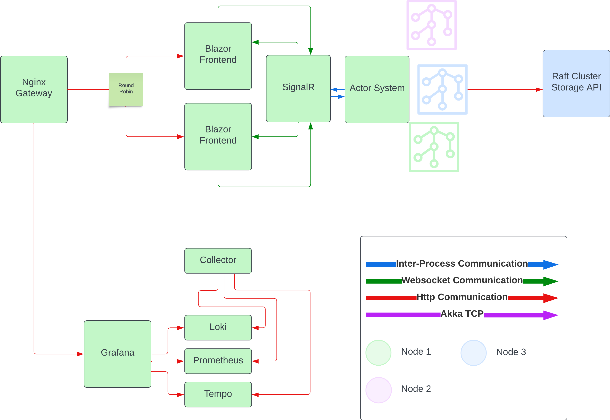

# Final Project Plan

## Architecture

### Overview

### Actor System

### Nginx Gateway

#### Responsibilities

- Direct traffic to the front facing services (Astroids Game, Grafana Dashboards)
- It will help load balance between the multiple frontends.

#### Redundancy Strategy

- Docker health checks of dependent services
- Stop nginx from relying on all services being up: [future reference](https://sandro-keil.de/blog/let-nginx-start-if-upstream-host-is-unavailable-or-down/)
- I don't believe the load will be enough to justify putting another load balancer in front of this and another gateway, it should be pretty stable.

### Blazor Front End

#### Responsibilities

- Provide an interface for a user to play/interact with the game
- has an actor that will communicate with the actor system
- when actor receives a message, it will update the UI through events

#### Redundancy Strategy

- Two statless instances of the Blazor front end
- If one goes down, user will be redirected to the other instance
- Docker health checks to restart the container if it goes down

### Actor System

#### Responsibilities

- Manage the game state and provide updates to the SignalR Message Server
- Frequently save the game state to the Raft Cluster Storage

#### Redundancy Strategy

- The akka cluster will be able to handle the loss of a node
- The akka cluster will be distributed across multiple machines
- Will use routers to distribute the load across the cluster
- Will use supervision to restart actors that fail

### Raft Cluster Storage API

#### Responsibilities

- Provide a way to store the game state
- Provide a way to retrieve the game state
- Keep the game state replicated across the cluster

#### Redundancy Strategy

- The Raft cluster will be distributed across multiple machines
- The Raft cluster will be able to handle the loss of a node (running with 3)

### Grafana, OpenTelemetry Collector, Loki, Prometheus, Tempo

#### Responsibilities

- Collect, store, and visualize the logs, metrics and traces from the system

#### Redundancy Strategy

- Docker health checks to restart the containers if they goes down
- Not vital to the system if it goes down for a short period of time
