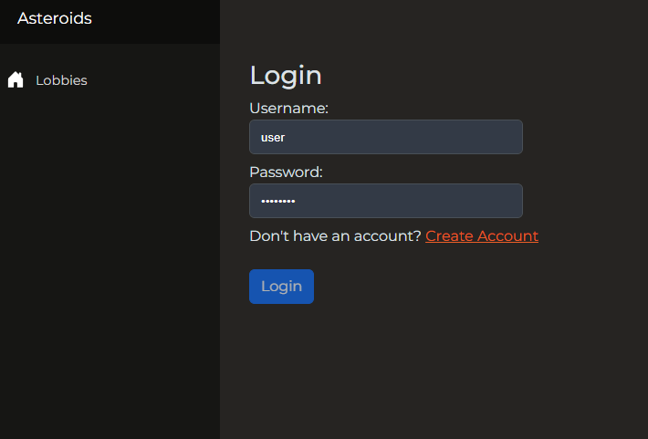
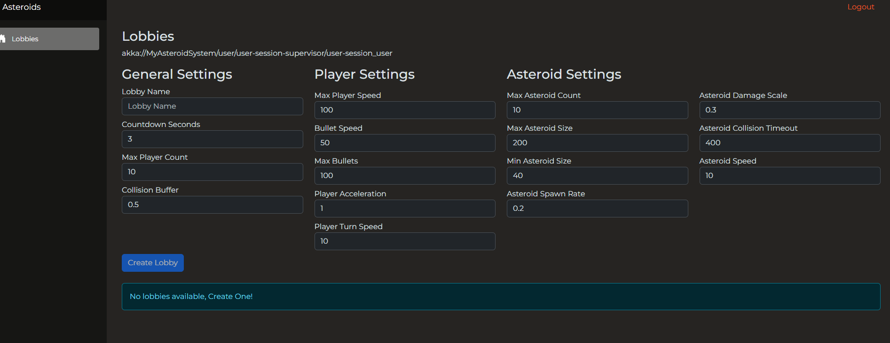
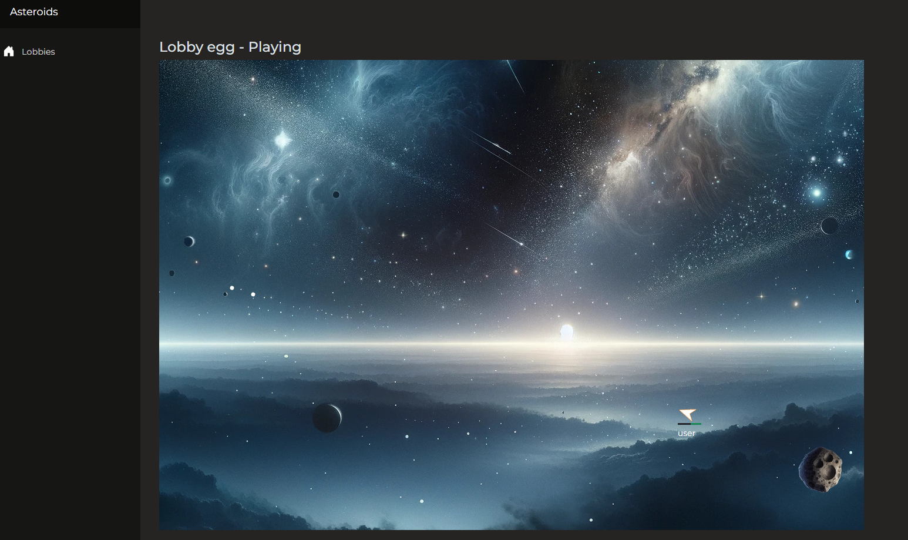
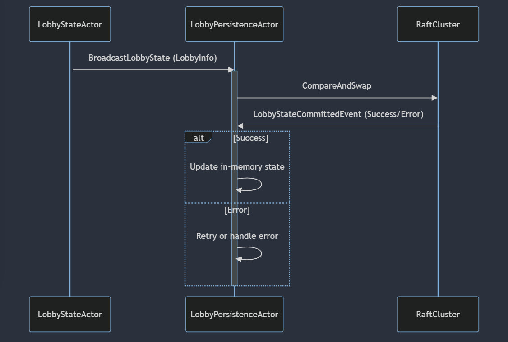
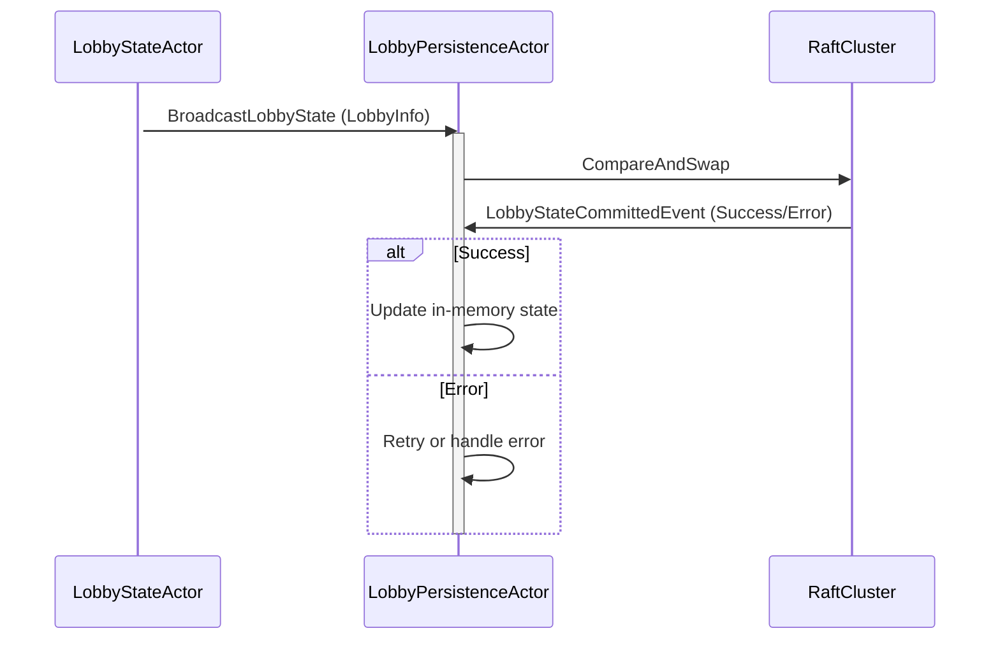
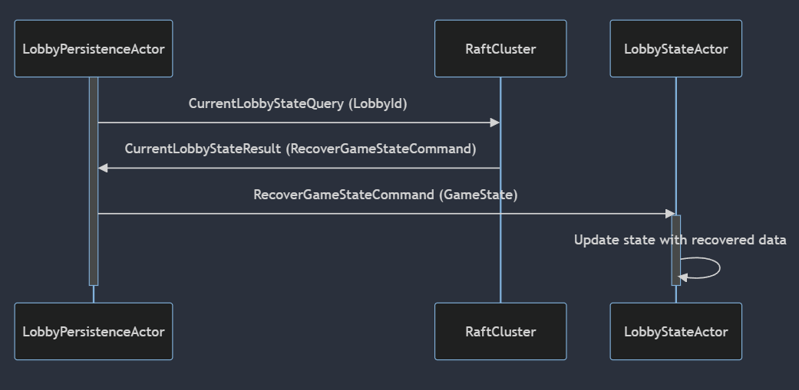
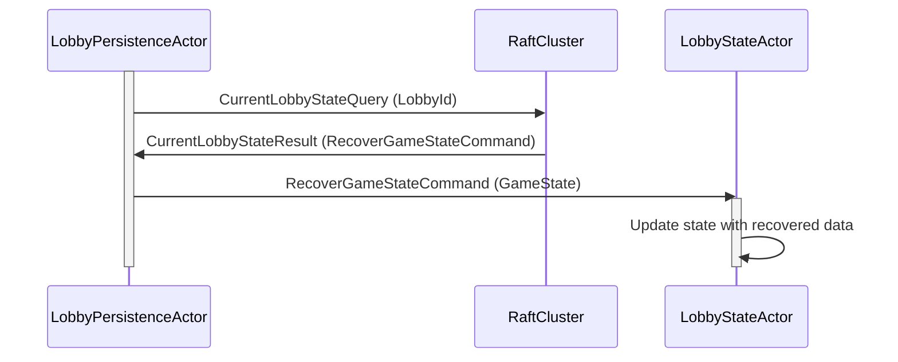

# Disasteroids

## https://disasteroids.duckdns.org:4321

---

## Game UI Screenshots

#### Login

[](images/login.png)

---

#### Lobby Creation

[](images/lobby_creation.png)

---

#### Game Play

[](images/playing.png)

---

## Rubric Demonstrations

- Frontend and actor system have two way communication
  - Error messages on login failure
- Raft used as the storage backend

  - [Grafana Raft Logs](https://disasteroids.duckdns.org:4321/grafana/d/d5155a4e-3253-463c-adb1-1782864b3945/raft-election-logs?orgId=1&refresh=5s)

- Game rules implemented
- 2 game customizations supported (Remember screen shot of lobby creation?)

---

- Countdown before game starts
- Server runs mulitple lobbies, each lobby has mulitple players, players can move and die
- Ships shoot bullets that damage asteroids
- Logging and metric displayed in near real-time dashboard
  - [Logs](https://disasteroids.duckdns.org:4321/grafana/d/cb4b1d49-f6b6-4122-8172-de2edf551c09/actor-system-specific-logs?orgId=1)
  - [Metrics](https://disasteroids.duckdns.org:4321/grafana/d/be150859-9942-4c8b-b0cb-e848b4ed74ef/asteroid-metrics?orgId=1)

---

- Asteroid size, speed, and damage is random influenced
- Random influenced asteroid spawn rate

```csharp
private void RandomlySpawnAsteroid()
{
    if (Asteroids.Count >= GameParameters.MaxAsteroids) return;
    if (new Random().NextDouble() < GameParameters.AsteroidSpawnRate)
    {
        var asteroid = new AsteroidState(GameParameters.AsteroidParameters)
        {
            Id = Guid.NewGuid(),
            Size = new Random().NextDouble() * GameParameters.MaxAsteroidSize,
            Location = GetRandomEdgeLocation(),
            Heading = new Heading((int)new Random().NextDouble() * 360),
            Rotation = (int)(new Random().NextDouble() * GameParameters.AsteroidParameters.MaxRotation),
            MomentumVector = new MomentumVector(
                (int)(new Random().NextDouble() * GameParameters.AsteroidParameters.MaxMomentum),
                (int)(new Random().NextDouble() * GameParameters.AsteroidParameters.MaxMomentum)),
        };

        Asteroids.Add(asteroid);
    }
}
```

---

- Hosted in production [here](https://disasteroids.duckdns.org:4321)
- Backend akka cluster can automatically recover from a node going down (game continues without developer intervention)
- 50 meaningful tests (next slides)

---

## Test Coverage

- Lobby Lifecycle:
  - Creation, joining, starting, and ending of lobbies. [here](../src\Asteroids\Asteroids.Tests\Lobbies\LobbySupervisorTests.cs)
  - Player joining and leaving. [here](../src\Asteroids\Asteroids.Tests\Lobbies\LobbyStateActorTests.cs)
  - Lobby state state broadcast and recovery message. [here](../src\Asteroids\Asteroids.Tests\Lobbies\LobbyStateActorTests.cs)
- User Session Lifecycle:
  - User session creation and termination. [here](../src\Asteroids\Asteroids.Tests\Accounts\AccountStateActorTests.cs)
  - Message forwarding between user session actors and other actors. [here](../src\Asteroids\Asteroids.Tests\Accounts\UserSessionActorTests.cs)
  - Session identification and validation. [here](../src\Asteroids\Asteroids.Tests\Accounts\UserSessionSupervisorTests.cs)

---

## Test Coverage Continued..

- Game Logic:
  - Player movement, rotation, and thrust application. [here](../src\Asteroids\Asteroids.Tests\GameMechanics\PlayerStateTests.cs)
  - Asteroid spawning, movement, and collision detection. [here](../src\Asteroids\Asteroids.Tests\GameMechanics\AsteroidStateTests.cs)
  - Bullet firing, movement, and collision detection. [here](../src\Asteroids\Asteroids.Tests\GameMechanics\BulletStateTests.cs)
  - Game state updates and broadcasting. [here](../src\Asteroids\Asteroids.Tests\GameMechanics\GameStateTests.cs)

---

## Complex Engineering Problems and Solutions

**Problem**: Ensuring reliable and fault-tolerant lobby and game state persistence for recovery in case of failures.

**Identification**: System crashes or network disruptions could lead to loss of game progress.

**Formal Definition**: Design a mechanism to consistently persist lobby and game state to enable recovery upon system restart.

---

**Solution**:

- Lobby State Actor periodically broadcasts its state to a persistent actor.
- Created a persistence actor that handles the persistence of the lobby state.
  - First, it receives the state from the lobby state actor, it then creates a request to persist the state in the raft cluster.
  - If the request is successful, it updates the state in the memory of the persistence actor.
- Upon recovery, the persistence actor rebuilds the state from the raft cluster and sends it to the lobby state actor.
- The lobby state actor updates its state with the recovered state.

---

## Lobby Persistence

[](images/lobbypersist.png)



---

## Lobby Recovery

[](images/lobbyrecovery.png)



---

## Principles of Engineering

**Abstraction**: Actor system provided clear boundaries / messaging interfaces, promoting modularity and decoupling.

**Modularity:** Divided the system into smaller, manageable components, enhancing maintainability and reusability. (Each actor has a single responsibility)

---

## Principles of Engineering Continued...

**Fault Tolerance:** Implemented strategies for handling failures and recovering state, ensuring system resilience. (Raft cluster for persistence, Redundant actor nodes / frontends)

**Testing:** Developed comprehensive unit tests to validate the correctness of the system components and prevent regressions.

---

## Principles of Science

**Experimentation:** Iteratively tested and refined game mechanics and algorithms to achieve optimal performance and user experience. (Game Mechanics Parameters, Unit Tests)

**Observation:** Monitored system behavior and collected data to identify and address performance bottlenecks. (Monitoring Infrastructure)

**Repeatable Environment:** Ensured consistent and reproducible environments for dev and prod to speed up development and debugging. (Docker compose, Github actions)

---

## Principles of Math

**Geometry:** Used pythagorean theorem to calculate distances between objects for collision detection.

```csharp
public static bool CollidedWith(this AsteroidState asteroid, AsteroidState otherAsteroid, double bufferScale = .5)
{
    var distance = Math.Pow(asteroid.Location.X - otherAsteroid.Location.X, 2) + Math.Pow(asteroid.Location.Y - otherAsteroid.Location.Y, 2);
    return distance < Math.Pow(asteroid.Size * bufferScale + otherAsteroid.Size * bufferScale, 2);
}
```

---

**Trigonometry:** Calculated directional vectors for player movement and bullet trajectories based on angles.

```csharp
public MomentumVector ApplyThrust(double deltaTime = 1)
{
    double angleInRadians = Heading.Angle * (Math.PI / 180);
    var accelerationX = Math.Cos(angleInRadians) * PlayerParameters.Acceleration * deltaTime;
    var accelerationY = Math.Sin(angleInRadians) * PlayerParameters.Acceleration * deltaTime;

    // Update momentum vector based on the direction of thrust
    var momentumX = MomentumVector.X + accelerationX;
    var momentumY = MomentumVector.Y + accelerationY;

    // Clamp the maximum speed to prevent the ship from going too fast
    var totalMomentum = Math.Sqrt(momentumX * momentumX + momentumY * momentumY);
    if (totalMomentum > PlayerParameters.MaxMomentum)
    {
        momentumX = momentumX / totalMomentum * PlayerParameters.MaxMomentum;
        momentumY = momentumY / totalMomentum * PlayerParameters.MaxMomentum;
    }

    MomentumVector = new MomentumVector(momentumX, momentumY);
    return MomentumVector;
}
```
